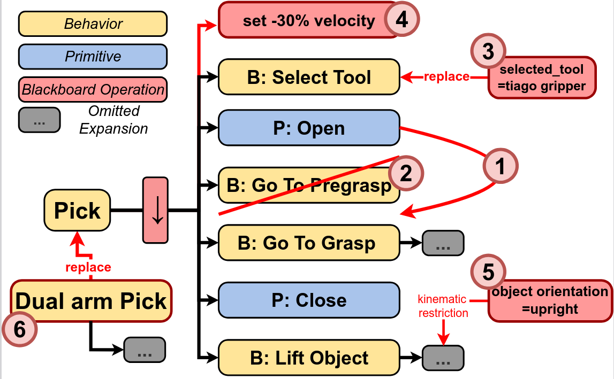

# WOSRA24 Knowledge-based Execution Configuration for Adaptive Behavior Trees




## Description

This repository contains the knowledge files supporting the implementation and evaluation of the methods presented in the paper "Knowledge-based Execution Configuration for Adaptive Behavior Trees.", part of the BeAware framework. These files correspond to the Extended Abstract submitted to the **International Workshop on Ontologies and Standards for Robotics and Automation (WOSRA 2024) @ ICRA 2024, May 13th, Yokohama, Japan**

The included resources provide essential components to understand and extend the example scenario discussed in the paper, including:

- Behavior Trees (BTs): Templates defining the structure and flow for the example scenario’s adaptive behaviors.

- Ontologies:
    - `beaware_ontology.owl`: The base ontology to use in the BeAware Framework.

    - `application_ontology_example.owl`: An instantiated ontology tailored for the specific example scenario.

- PDDL: A Planning Domain Definition Language (PDDL) domain file that formalizes the planning aspects of the example scenario.


---

## Citation

This dataset repository corresponds to the following publication:

```
@misc{ruiz_celada_2024_18596503,
  author       = {Ruiz Celada, Oriol and
                  Rosell, Jan and
                  Suarez, Raul},
  title        = {IntelliMan\_WP5\_Grasping, Manipulation and Arm-Hand
                   Coordination\_T5.4\_Experience- and model-based
                   Grasp Synthesis and Manipulation\_WOSRA24
                  },
  month        = may,
  year         = 2024,
  publisher    = {Zenodo},
  doi          = {10.5281/zenodo.18596503},
  url          = {https://doi.org/10.5281/zenodo.18596503},
}
```
---


## Authors

- **Oriol Ruiz-Celada**  (Corresponding Author)
  Institute of Industrial and Control Engineering  
  Universitat Politècnica de Catalunya, Barcelona, Spain  
  Email: oriol.ruiz.celada@upc.edu  


- **Jan Rosell**  
  Institute of Industrial and Control Engineering  
  Universitat Politècnica de Catalunya, Barcelona, Spain  
  Email: jan.rosell@upc.edu  


- **Raúl Suárez**  
  Institute of Industrial and Control Engineering  
  Universitat Politècnica de Catalunya, Barcelona, Spain  
  Email: raul.suarez@upc.edu  


### Correspondence

For any inquiries regarding this repository or the associated paper, please contact the corresponding author: **Oriol Ruiz-Celada** at [oriol.ruiz.celada@upc.edu](mailto:oriol.ruiz.celada@upc.edu).